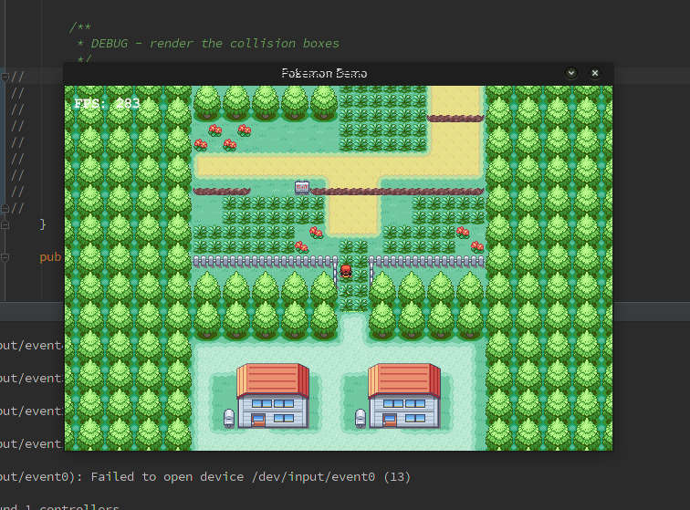

I felt like writing up a clone of pokemon red (or parts of it, at least) so I could mess in one of my favourite games of all time. Since I'm probably going to get nailed by copyright lawyers at some point, here's an image of what this looks like in practice:

To compile and run this, you'll have to link it with the Slick2D graphics library.
